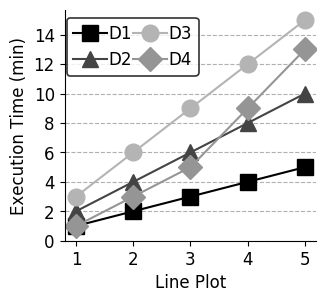

# Line Plot
A snippet of code to create a line plot in matplotlib

<p align="center"> 

</p>

## Configuration
The config.py file locates all the design parameters (e.g. colors, line width, figure size e.t.c) for the plots. You can easily change just the parameters in configuraiton file and re-run the script.

## Run Script
```bash
./run_all.sh
```
## Help
```bash
./line_plot.py -h
```
will show:
```
Options:
  -h, --help            show this help message and exit
  -i FILE, --input=FILE
                        Input File/s
  -o FILE, --output=FILE
                        Output File
  -x XLABEL, --xlabel=XLABEL
                        X-label
  -y YLABEL, --ylabel=YLABEL
                        X-label
```
